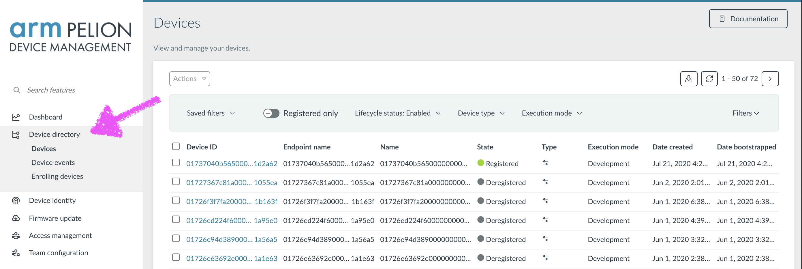
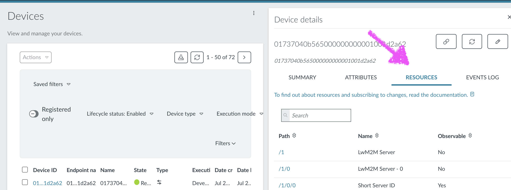
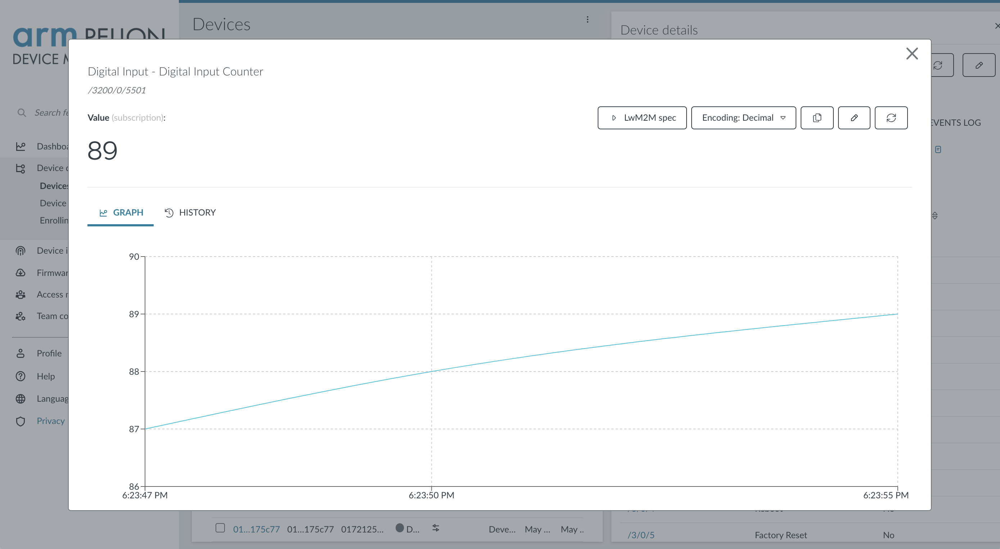
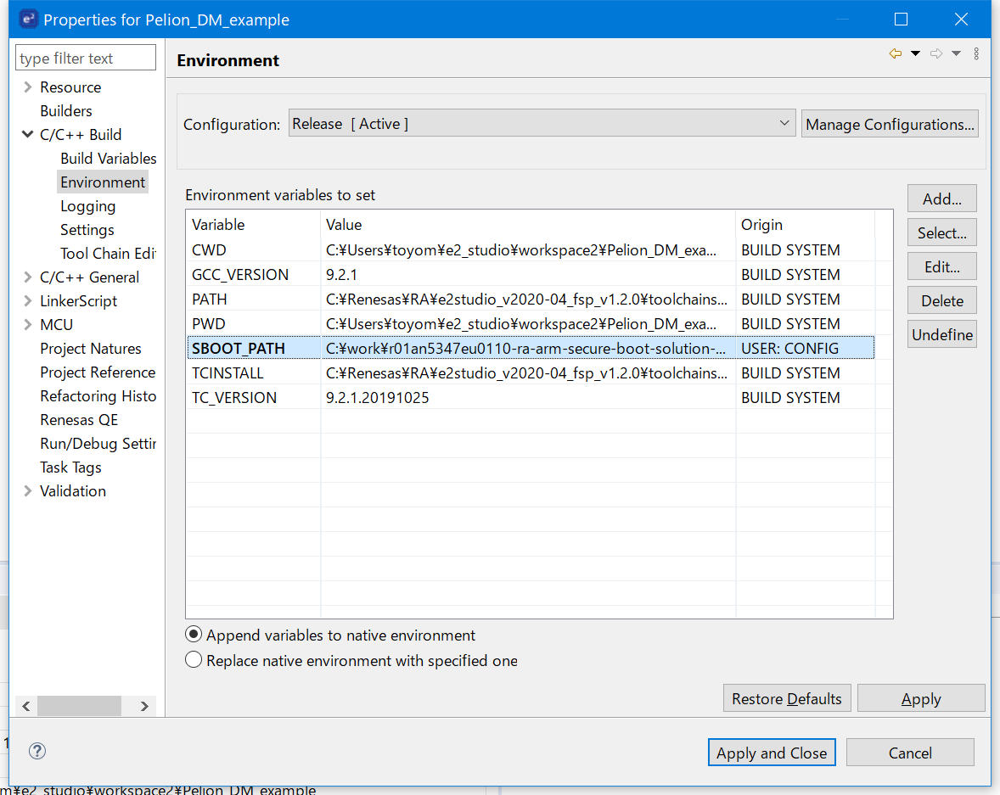
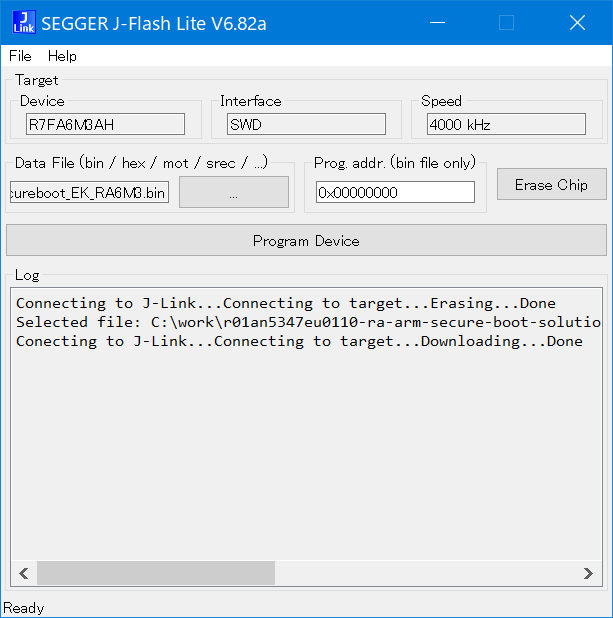
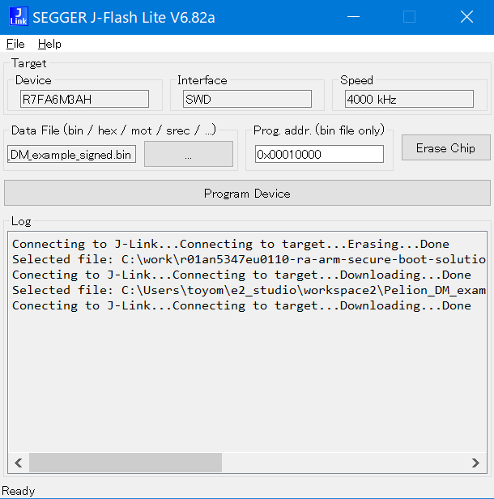

# pelion-dm-example-ra6m3-e2-studio
Pelion Device Management example for Renesas EK-RA6M3 e<sup>2</sup> studio project

## Setup
### Install software
* Renesas FSP with e<sup>2</sup> studio Installer  
https://github.com/renesas/fsp/releases/download/v1.2.0/setup_fsp_v1_2_0_e2s_v2020-04.exe
* SEGGER J-Link software  
https://www.segger.com/downloads/jlink/#J-LinkSoftwareAndDocumentationPack
* python 3.x  
https://www.python.org/downloads/
* Git SCM  
https://git-scm.com/downloads
* Renesas Secure Boot Package in Application Note r01an5347eu0110-ra-arm-secure-boot-solution-ra6m3.zip - download and unzip all files  
https://www.renesas.com/us/en/software/D6004344.html
* manifest-tool v1.5.2
  Open command prompt
```
$ git clone -b v1.5.2 https://github.com/ARMmbed/manifest-tool
$ cd manifest-tool
$ pip install .
```
* Install other python modules
```
$ pip install -U cbor mbed-cloud-sdk
```

### Create Pelion Device Management account and developer certificate

* Signing up or logging in to Device Management Portal  
https://www.pelion.com/docs/device-management/current/user-account/index.html

* Creating and downloading a developer certificate (`mbed_cloud_dev_credentials.c`)  
https://www.pelion.com/docs/device-management/current/provisioning-process/provisioning-development-devices.html
* Create API key with `Administrators` group privileges  
https://www.pelion.com/docs/device-management/current/user-account/api-keys.html#creating-a-key


## How to import/build the example project (for Debug target)

### Import the example project
* Launch e<sup>2</sup> studio
[File] - [Import] - [General] - [Existing Projects into Workspace]
Click [Next >] button 
* [Select this archive file] and browse the zip file
Click [Finish] button

### Build the project
* Open `configurations.xml` in the project
Click [Generate Project Content] to generate code
* Copy your Pelion developer cirtificate file `${ProjName}/pdmc/mbed_cloud_dev_credentials.c` (overwrite existing file)
* Click Build button to compile/link the project

### Setup EK-RA6M3 hardware
* Connect USB cable between host PC and DEBUG USB port (J10) of EK-RA6M3
* Connect Ethernet cable

### Debug the project
* Launch J-Link RTT Viewer application
  * Connection to J-Link - USB
  * Specify Target Device - R7FA6M3AH
  * Target Interface & Speed - SWD, 4000 kHz
  * RTT Control Block - Auto Detection
* Click [OK] button to connect the target

* Back to e<sup>2</sup> studio IDE
* Click `Debug Pelion_DM_example.elf` button
* The Pelion_DM_example.elf binary is flashed to the target board 
* Confirm Perspective Switch - click [Yes] button 
Click [Resume] button to run the program 

### Browse your device resource from portal

* Open Pelion Device Management portal page  
https://portal.mbedcloud.com/
* Select your device from Device directory  
https://portal.mbedcloud.com/devices/list  
  
  
* Click `RESOURCES` tab
  
  
* Click `/3200/0/5501` resource (button_resource)
  

## How to make firmware update (for Release target)

The Release target of this example support firmware update feature with Renesas secure bootloader.

### Build the firmware

* Change active target to `Release`
* Initialize the firmware-update-specific resources
  * Right click the project and navigate to `Command Prompt`
  * Use following commands to create update certificate
```
$ cd pdmc
$ manifest-tool init -a <API key> -d arm.com -m example-app --force -q
$ exit
```
* Open project properties - [C/C++ Build] - [Environment]
* Set `SBOOT_PATH` to secure boot package path in the [application note](https://www.renesas.com/us/en/software/D6004344.html), [Apply and Close] button  
  
* Build the project

### Flash secure bootloader and firmware

* Open SEGGER J-Flash Lite application
* Connect the EK-RA6M3 target board
* Erase the chip
* Flash secure bootloader at address 0  
`{your-SecureBoot_Package-path}\scripts\downloader\BL2_download\Secureboot_EK_RA6M3.bin`  
  

* Flash the signed firmware at address 0x00010000  
`{your-workspace-path}\Pelion_DM_example\pdmc\Release\Release\Pelion_DM_example_signed.bin`  
  
* Close the J-Flash Lite application
* Launch J-Link RTT Viewer application and connect the target

Your device is now connected and ready for firmware update. For development devices, the Endpoint name and Device ID are identical.

### Updating the firmware

* Build your program for the Release target
* Right click the project and navigate to `Command Prompt`
```
$ cd pdmc
$ manifest-tool update device -p ..\Release\Pelion_DM_example_signed.bin -D <Device ID> -a <API Key>
```

When the update starts, the client tracing log shows:
```
Firmware download requested
Authorization granted
...
Downloading: 100 %
Download completed
Firmware install requested
Authorization granted
```

After this, the device reboots automatically and registers to Device Management.


## See also

Pelion Device Management document  
https://www.pelion.com/docs/device-management/current/welcome/index.html

Command-line tutorial for Renesas SDK with Pelion Device Management  
https://www.pelion.com/docs/device-management/current/connecting/renesas-sdk.html
